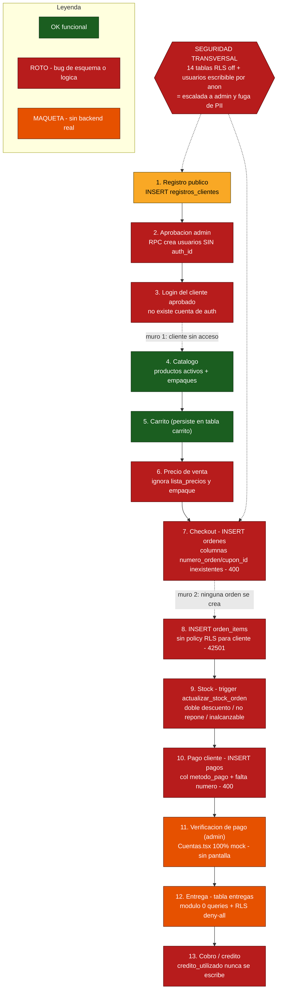
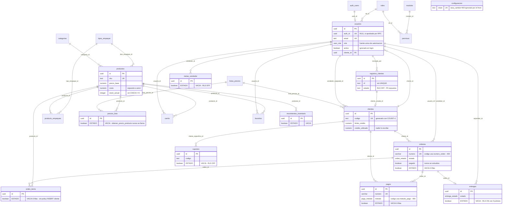

A continuación, la consolidación de la auditoría de los 9 módulos de GUDS.

---

# GUDS — Auditoría Arquitectónica Consolidada

## 1) ESTADO REAL DEL SISTEMA

GUDS es una **maqueta navegable con islas funcionales, no un producto operativo**. Medido por líneas de código, ~31% de la aplicación es maqueta pura (archivos que ni siquiera importan `supabase` y pintan arrays inventados con datos de México — clientes tipo Walmart/OXXO, direcciones de CDMX, teléfonos +52 — sobre una distribuidora venezolana). Pero la métrica por líneas engaña: del ~69% "conectado a Supabase", **todo el núcleo transaccional está roto por nombres de columna que no existen en el esquema**, así que tampoco produce ni un registro. Lo que sí funciona de punta a punta se reduce a: login/logout, catálogo, carrito (hasta antes de confirmar), CRUD de productos, inventario manual, clientes, categorías, banners, usuarios/roles e iconos. Lo que **aparenta** funcionar pero no genera ni una fila es exactamente el conjunto de tablas vacías: `ordenes`, `orden_items`, `pagos`, `entregas`, `cupones`, `metas_vendedor`, `notificaciones`, `precios_lista`, `movimientos_inventario`. El nucleo del negocio —vender, cobrar, entregar— nunca se ha ejecutado porque **no puede** ejecutarse: no es falta de uso, es un bug de esquema replicado en 9 archivos.

Encima de esto hay una **capa de seguridad esencialmente ausente**. El control de acceso es 100% client-side (`ProtectedRoute` decide qué se pinta, no qué acepta la API). En la base de datos, 14 tablas tienen RLS DESACTIVADO con GRANT total a `anon`, y `usuarios` tiene una política `ALL / public / USING true`: con la anon key del bundle público **cualquier anónimo puede leerse la lista de leads B2B con RIF/teléfono/dirección, ver el costo de compra de los 81 productos, y ascenderse a sí mismo a `role='admin'` con un solo PATCH**, heredando el acceso también a nivel de motor porque las políticas "buenas" evalúan `usuarios.role='admin'`. Sumado a esto: tasa de cambio hardcodeada (36.85 vs 400 real → todo precio en Bs. cobra el ~9% de lo debido), el carrito que cobra precio unitario por cajas/bultos (~96% menos), y clientes aprobados que **nunca pueden iniciar sesión**. Veredicto sin diplomacia: **es un prototipo de demostración, no apto para operar ni para exponerse a internet en su estado actual.**

---

## 2) EL CAMINO CRÍTICO ROTO (cliente → entrega cobrada)

Cadena real, eslabón por eslabón. El primer punto de fallo terminal aparece en el paso 2, y hay un segundo muro absoluto en el paso 6.

| # | Eslabón | Estado | Por qué falla |
|---|---------|--------|---------------|
| 1 | Registro público → `registros_clientes` | ⚠️ FUNCIONA (frágil) | Inserta en camino feliz, pero `Registro.tsx:120` reporta "¡Solicitud Enviada!" aunque el INSERT falle (sin `await`, ignora el booleano). Además fuga de PII (RLS off). |
| 2 | Aprobación admin → `aprobar_registro_cliente` | ❌ ROTO (terminal) | La RPC crea la fila en `usuarios` **sin `auth_id` y sin cuenta en `auth.users`**. No envía credenciales. El cliente queda registrado y **jamás puede loguearse**. El `UNIQUE(email)` además quema ese correo para siempre. |
| 3 | Login del cliente aprobado | ❌ ROTO | `signInWithPassword` falla: no existe la cuenta de auth. No hay recuperación de contraseña (link `href="#"`). |
| 4 | Catálogo → `productos` | ✅ OK | Lee productos activos y empaques. (Ignora lista de precios del cliente.) |
| 5 | Carrito → `carrito` | ✅ OK persiste / ❌ precio | Persiste bien, pero recalcula precio con `precio_base` ignorando `precio_unitario` y el empaque → infrafactura cajas/bultos. |
| 6 | **Checkout → INSERT `ordenes`** | ❌ ROTO (terminal) | Inserta `numero_orden` (la columna es `numero`) y `cupon_id` (no existe) → **HTTP 400 SIEMPRE**. `PortalCarrito.tsx:183` y `Ordenes.tsx:207`. **Causa raíz de que `ordenes`=0.** Ni cliente ni admin pueden crear una orden. |
| 7 | INSERT `orden_items` | ❌ ROTO | Aunque se arregle el paso 6: no existe política RLS de INSERT para rol `cliente` → 42501. Sin transacción → órdenes huérfanas. |
| 8 | Stock → trigger `actualizar_stock_orden` | ❌ ROTO | Inalcanzable (no hay órdenes). Además: doble descuento al volver a 'pendiente', no repone al cancelar, sin `CHECK(stock>=0)`. |
| 9 | Pago → INSERT `pagos` | ❌ ROTO | Usa `metodo_pago` (la columna es `metodo`), no envía `numero` (NOT NULL sin default), embed a `numero_orden` inexistente → 400. `PortalPagos.tsx:135`. |
| 10 | Verificación de pago (admin) | ⚠️ MAQUETA | No existe pantalla. `Cuentas.tsx` es 100% mock. `ordenes.pagado` nunca se actualiza. |
| 11 | Entrega → `entregas` | ⚠️ MAQUETA | Módulo delivery = 0 queries a Supabase (5 pantallas). `entregas` tiene RLS ON con **0 políticas** = deny-all. Nadie escribe la fila. No hay usuario `role='delivery'` operativo con datos. |
| 12 | Cobro / crédito → `credito_utilizado` | ❌ ROTO | `credito_utilizado` solo se muestra, **nadie lo escribe**. Sin validación de límite en checkout → crédito ilimitado de facto. |

**Conclusión:** hay **dos muros absolutos** independientes. Aunque se arreglara el checkout (paso 6), ningún cliente aprobado podría siquiera llegar a él (paso 2/3). Y aunque un cliente comprara, no hay forma de verificar el pago, generar la entrega, ni consumir el crédito. **Hoy es estructuralmente imposible que un pedido recorra el ciclo completo.**

---

## 3) TOP 10 ARREGLOS POR IMPACTO DE NEGOCIO

Ordenados por dinero y riesgo, no por facilidad.

1. **Desbloquear la creación de órdenes.** `src/pages/portal/PortalCarrito.tsx:183` y `src/pages/Ordenes.tsx:207`: renombrar `numero_orden`→`numero`, eliminar `cupon_id`, y persistir `envio`+`impuesto`. Mejor: mover a una RPC transaccional que llame `generar_numero_orden()` e inserte cabecera+items+vaciado de carrito en una sola transacción. *Sin esto, cero ingresos posibles en todo el sistema.*

2. **Corregir la tasa de cambio.** `src/contexts/CurrencyContext.tsx:17`: eliminar `useState(36.85)`; cargar `tasa_cambio` de `configuracion` en un `useEffect` y refrescarla al guardar en `ConfigMoneda`. Congelar la tasa por orden. *Hoy cada precio en Bs. cobra el ~9% de lo debido (400 real vs 36.85).*

3. **Cobrar el precio del empaque, no el unitario.** `src/pages/portal/PortalCarrito.tsx:146` (y select en :77): usar `item.precio_unitario`/`tipo_empaque_id` como fuente de verdad. *Una caja de 24 se cobra como 1 unidad → 96% de pérdida por línea.*

4. **Dar credenciales al cliente aprobado.** `src/contexts/AuthContext.tsx:297` + RPC `aprobar_registro_cliente`: Edge Function con `service_role` que haga `auth.admin.createUser`/`inviteUserByEmail` y grabe `auth_id` en `usuarios` en la misma transacción. *Sin esto ningún cliente puede usar el portal jamás.*

5. **Cerrar los agujeros de RLS.** `src/lib/supabase.ts:4` / BD: `DROP POLICY "Escritura publica de usuarios"` y `"Lectura publica de usuarios"`; `ENABLE ROW LEVEL SECURITY` en las 14 tablas expuestas; `REVOKE INSERT/UPDATE/DELETE ... FROM anon`. `usuarios.role` nunca escribible por el propio usuario. *Previene escalada a admin, borrado del admin real y fuga de leads+costos.*

6. **Reparar y cerrar el ciclo de pagos.** `src/pages/portal/PortalPagos.tsx:135`: `metodo_pago`→`metodo`, añadir `numero` (vía `generar_numero_pago()`), embed a `numero`. Construir la **bandeja de verificación de pagos del admin** que al aprobar actualice `ordenes.pagado` y `clientes.credito_utilizado`. *Sin esto no se puede cobrar ni conciliar.*

7. **Política INSERT de `orden_items` + atomicidad.** BD: `CREATE POLICY "Clientes crean items de sus ordenes" ON orden_items FOR INSERT ...`; y checkout atómico (RPC `SECURITY DEFINER`). `src/pages/portal/PortalCarrito.tsx:210`. *Evita órdenes fantasma sin líneas.*

8. **Consumir y validar el crédito.** `src/pages/portal/PortalCarrito.tsx:161`: bloquear checkout a crédito si `total > limite_credito - credito_utilizado`; trigger que incremente `credito_utilizado` al crear la orden a crédito y lo libere al verificar el pago. *Hoy la exposición real es invisible y sin freno.*

9. **Que desactivar un usuario revoque el acceso.** `src/contexts/AuthContext.tsx:243` (y `checkSession` :64): si `!userData.activo` → `signOut()` + `{success:false}`. Reforzar con `AND activo` en las políticas RLS. *Hoy un empleado despedido sigue entrando con normalidad.*

10. **Alinear la máquina de estados de la orden.** `src/pages/Ordenes.tsx:446`: usar el enum real (`pendiente, procesando, enviado, completado, cancelado`); quitar `confirmado`/`entregado`, añadir `completado`. `src/pages/portal/PortalPedidos.tsx:96`: `'entregado'`→`'completado'`. Hacer idempotente el trigger de stock y añadir rama de reposición en `cancelado`. *Hoy ninguna orden puede cerrarse ni el historial del cliente se puebla.*

---

## 4) MAPA DE FLUJO END-TO-END

Nota: el paso 1 (amarillo) inserta en el camino feliz pero miente si falla y filtra PII; los únicos verdaderos verdes de la cadena de negocio son el catálogo y la persistencia del carrito.

---

## 5) MODELO DE DATOS (relaciones reales)

`ESTADO "VACIA-0-filas"` marca las tablas del núcleo transaccional que nunca se han ejercitado.

---

## 6) PREGUNTAS PARA EL DUEÑO (8 decisiones que cambian qué se construye)

**1. ¿Cómo recibe el cliente aprobado sus credenciales de acceso?**
Hoy `aprobar_registro_cliente` crea la fila en `usuarios` sin `auth_id` y sin cuenta en `auth.users`, y `UNIQUE(email)` quema ese correo para futuros intentos. El flujo entero de onboarding termina en un cliente que no puede entrar. Opciones: (a) Edge Function con `service_role` que invite por email (`inviteUserByEmail`) y el cliente fije su clave; (b) generar contraseña temporal y comunicarla por WhatsApp; (c) auto-registro vinculado por email. **Determina toda la arquitectura de alta y si se mantiene la cola de aprobación.**

**2. ¿El sistema de roles/permisos granular es la fuente de verdad, o se elimina?**
Conviven dos modelos: el enum `usuarios.role` (lo único que leen `ProtectedRoute` y las políticas RLS) y `roles`+`modulos`+`permisos` (24 permisos ya poblados que ningún guard consulta). Editar la matriz de permisos hoy no cambia absolutamente nada, y roles como 'Almacén'/'Contador' caen silenciosamente a `role='cliente'`. Opciones: (a) cablear el motor granular en AuthContext, ProtectedRoute y RLS; (b) borrar esas pantallas y quedarse con el enum. **Afecta gran parte de ConfigUsuarios y el diseño completo de RLS.**

**3. ¿Se factura precio diferenciado por cliente (listas de precios)?**
Existen `listas_precios`, `precios_lista`, `clientes.lista_precios_id` y la RPC `obtener_precio_producto`, pero **ningún punto de venta los usa**: todo el portal cobra `precio_base`. Con `precios_lista` vacía el bug es invisible hoy y se activará en silencio con el primer precio negociado. Opciones: (a) cablear la RPC en catálogo/carrito/checkout y corregirla para que aplique `porcentaje_descuento`; (b) abandonar el concepto y borrar esas tablas. **Cambia si hay que construir toda la capa de precios por cliente.**

**4. ¿Los `precio_base` ya incluyen IVA o falta aplicar el 16%?**
`configuracion.iva_porcentaje=16` y `ordenes.impuesto` existen, pero ningún cálculo de la app aplica impuesto (`total = subtotal - descuento + envio`). Es una decisión fiscal, no técnica: **cambia el total facturado de cada pedido** y si hay que añadir el desglose de impuesto a la orden.

**5. ¿`precio_base` es por unidad individual o por el empaque seleccionado?**
El portal asume por-unidad y multiplica por `tipo_empaque.unidades` (una Caja de 12 = `precio_base`×12), pero existe `producto_empaques.precio_empaque` (precio explícito por empaque) que nadie usa. **Con 81 productos ya cargados a mano, si el criterio fue "precio de la caja", el portal cobra 12×–24×.** Hay que fijar el modelo de precio antes de tocar el cálculo del carrito.

**6. El límite de crédito: ¿bloquea el checkout, y cuándo se consume/libera?**
`credito_utilizado` se muestra en 4 pantallas pero nadie lo escribe, y el checkout ofrece "Crédito (30 días)" a todos sin validar el cupo. Hay que decidir: ¿bloquea al exceder el límite o es solo informativo? ¿Se devenga al crear la orden, al procesarla, o al entregar? ¿Se libera al registrar el pago o al verificarlo? **Determina dónde van los triggers de crédito y la validación del checkout.**

**7. Los módulos Delivery (5 pantallas) y Vendedor (5 pantallas): ¿alcance comprometido o demo de venta?**
Son ~3.700 líneas 100% maqueta, sin una sola query a Supabase, con datos de México (Walmart, OXXO, direcciones de CDMX). La BD sí tiene el modelo correcto (`entregas`, `metas_vendedor`, políticas RLS por vendedor) pero desconectado, y `entregas` tiene RLS deny-all. Opciones: (a) construir los 10 flujos y sus políticas RLS; (b) retirarlos del menú antes de mostrar el sistema. **Decide construir vs eliminar ~1/3 de la superficie de UI.**

**8. ¿Cuál es la máquina de estados definitiva de una orden (y cuándo mueve el stock)?**
El enum real es `pendiente, procesando, enviado, completado, cancelado`, pero la UI ofrece `confirmado` y `entregado` (que revientan) y nunca `completado`. Falta definir: ¿se añade un estado 'confirmado' de aceptación? ¿'entregado' = 'completado' o completado = entregado + cobrado? ¿En qué transición se descuenta el stock y se repone al cancelar? **Hay que fijar el ciclo de vida antes de que el inventario y las entregas dependan de él.**

*(Preguntas secundarias no incluidas en el top 8 pero que requieren respuesta: adaptación fiscal México→Venezuela de Empresa/Facturación/Envíos; si el envío es tarifa plana o por zona/peso; y si se necesita recuperación de contraseña —hoy inexistente.)*